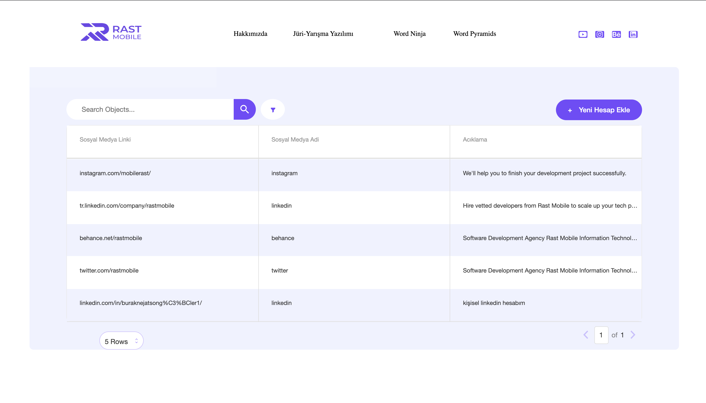

# DataGrid Projesi

Bu proje, React.js ve Devexpress Data Grid kütüphanesi kullanılarak geliştirilmiş bir DataGrid uygulamasıdır. Projenin amacı, kullanıcının sosyal medya bilgilerini düzenlemesini sağlamak ve bu bilgileri yönetebilmesini sağlamaktır.

## Özellikler

- 3 farklı input alanı (Sosyal Medya Linki, Sosyal Medya Adı, Açıklama)
- Alfabetik sıralama özelliği kullanıcıya kolon başlıklarına tıklayarak sunulur.
- Kullanıcı, buton aracılığıyla görüntülemek istediği satır sayısını belirleyebilir.
- Kullanıcı, yeni bir kullanıcı ekleyebilir ve bu bilgileri localStorage'a kaydedebilir.
- Kullanıcı, tüm inputları filtreleyebilir.

## Adımlar

1. Öncelikle projenin görevini okuyarak, figma tasarımından projeyi inceledim.
2. Projem için bir React.js projesi oluşturdum ve 3 ana başlıkta (Header, Table, AddNewAccount) bileşen yapılarını oluşturdum.
3. Responsive bir yapı için react-bootstrap kullanarak Header bileşenini oluşturdum.
4. Varsayılan verileri "data2" dosyasına ekledim.
5. React Data Grid kütüphanesindeki "Record Paging" yapısını kullanarak, projeme uygun hale getirdim (özellikler, kolon sayısı vb.).
6. Kütüphane tarafından sağlanmayan butonları ve arama çubuğunu ekledim.
7. "data2" dosyasındaki verileri projemdeki Grid yapısına entegre ettim.
8. Filtreleme ve satır sayısını belirlemek için useState hook'unu kullandım.
9. Yeni kullanıcı ekleme alanının tasarımı için react-bootstrap kullanarak bir form oluşturdum. Böylece tasarım responsive hale geldi.
10. Kullanıcının eklediği kullanıcı bilgilerini localStorage'a kaydederek, verilerin projeyi kapatıp açsak bile saklanmasını sağladım.

## Kurulum

1. Projeyi klonlayın: `git clone https://github.com/your-username/your-project.git`
2. Proje dizinine gidin: `cd your-project`
3. Gerekli bağımlılıkları yükleyin: `npm install`

## Kullanım

Proje bağımlılıklarını yükledikten sonra, aşağıdaki komutları kullanarak projeyi başlatabilirsiniz:npm start

Proje çalıştırıldığında, tarayıcınızda projenin çalışan bir örneği görüntülenecektir. Kullanıcılar, sosyal medya bilgilerini ekleyebilir, düzenleyebilir ve filtreleyebilirler.

## Ekran Görüntüleri

## Katkıda Bulunma

Projeyle ilgili geri bildirimleri, sorunları veya önerileri "Issues" bölümünde bildirebilir veya doğrudan bir pull isteği oluşturarak katkıda bulunabilirsiniz.

## Lisans

Bu proje [lisans türünü buraya yazabilirsiniz]. Daha fazla bilgi için `LICENSE` dosyasını inceleyin.

## İletişim

Eğer projem hakkında sorularınız veya geri bildirimleriniz varsa, benimle [nejat.980@hotmail.com] adresinden iletişime geçebilirsiniz.

